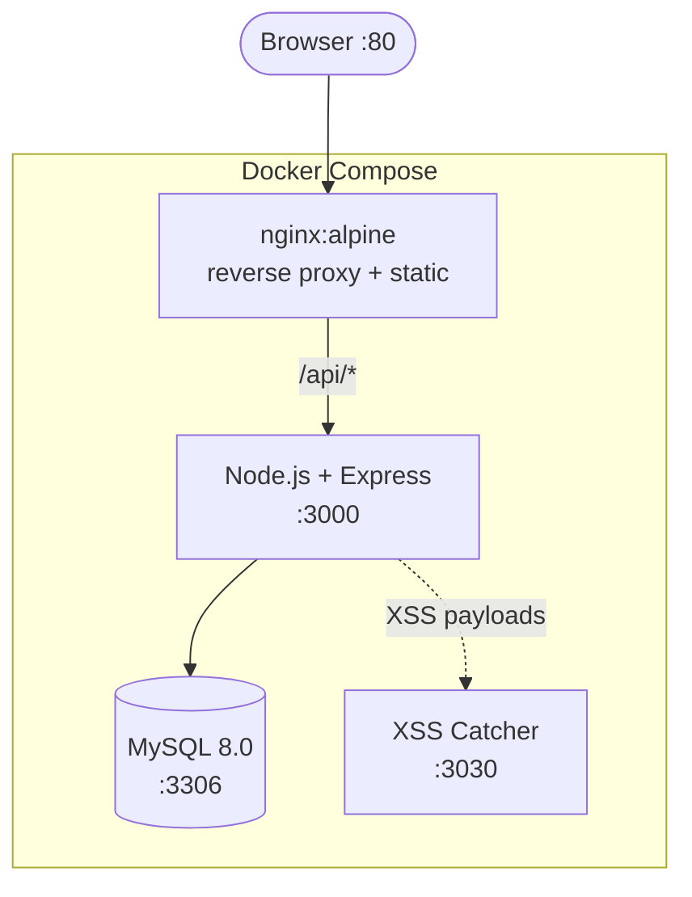

# ExploreYourDoors

Intentionally vulnerable web application — online store with toggleable security vulnerabilities.
Built for security training: SQL Injection, XSS, Code Injection, DoS, Unrestricted File Upload.

Each vulnerability can be enabled/disabled via config without changing code.

> **Warning**: This application is intentionally vulnerable. Do not expose to public networks.

## Architecture



## Tech Stack

| Layer | Technology |
|---|---|
| Frontend | HTML / CSS / vanilla JS |
| Backend | Node.js 18, Express.js |
| Database | MySQL 8.0 |
| Reverse Proxy | Nginx (Alpine) |
| Monitoring | XSS Catcher (custom Node.js service) |
| Infrastructure | Docker Compose (4 containers) |

## Vulnerabilities

Controlled via `backend/src/config/vulnerabilities.json`:

| Vulnerability | CWE | Route |
|---|---|---|
| SQL Injection | CWE-89 | `/api/search`, `/api/login` |
| Cross-Site Scripting (XSS) | CWE-79 | `/api/reviews` |
| Denial of Service | CWE-20 | `/api/search` |
| Code Injection | CWE-94 | Image upload (PHP via include) |
| Unrestricted File Upload | CWE-434 | `/api/profile` (avatar) |

## Quick Start

```bash
git clone https://github.com/<your-username>/ExploreYourDoors.git
cd ExploreYourDoors
cp .env.example .env
docker-compose up --build
```

Open `http://localhost` in browser.

XSS Catcher dashboard: `http://localhost:3030`

## Default Credentials

| User | Password | Role |
|---|---|---|
| admin | admin123 | admin |
| user1 | password1 | user |

## Project Structure

```
ExploreYourDoors/
├── backend/
│   ├── src/
│   │   ├── config/
│   │   │   ├── db.js
│   │   │   └── vulnerabilities.json    # vulnerability toggle
│   │   ├── middleware/
│   │   │   ├── auth.js
│   │   │   └── fileUpload.js
│   │   ├── routes/
│   │   │   ├── auth.js                 # login/register (SQLi)
│   │   │   ├── search.js               # product search (SQLi, DoS)
│   │   │   ├── reviews.js              # reviews (XSS)
│   │   │   └── profile.js              # avatar upload (Code Injection)
│   │   ├── services/
│   │   │   └── imageProcessor.js       # PHP code injection via include()
│   │   └── server.js
│   ├── xss-catcher/                    # XSS monitoring microservice
│   ├── Dockerfile
│   └── package.json
├── frontend/                           # static HTML/JS/CSS
├── db/
│   └── init.sql                        # schema + seed data
├── docker-compose.yml
├── nginx.conf
├── .env.example
└── README.md
```

## License

MIT
## Author

Artem Gomonenko — [gomonenkoartem@gmail.com](mailto:gomonenkoartem@gmail.com) , [Telegram](https://t.me/TemaBless) 
